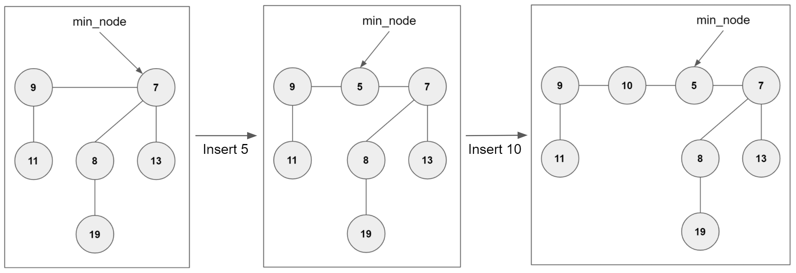
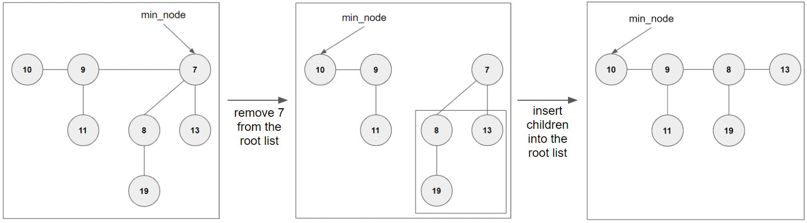
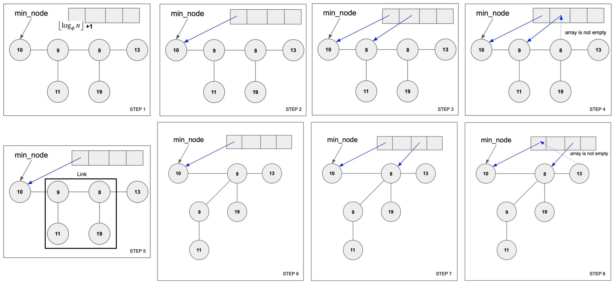
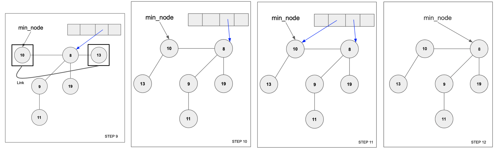

# HW#6: Fibonacci Heap

* **Due date: 11:59pm, 11/26/2020**
* TA: Sangyun Kim (ksu880@snu.ac.kr)

## Goals

* Understand Priority Queue abstract data structure.
* Learn specific priority queue implementation, **FibonacciHeap**.
* Get familiar with C++ **smart pointers**, especially `shared_ptr` and `weak_ptr`.

### Table of contents

1. [Priority Queue](#Priority-Queue)
2. [Fibonacci Heap](#Fibonacci-Heap)
3. [Basic Operations](#Basic-Operations)
4. [Provided Classes](#Provided-Classes)
5. [Goal & Grading](#Goal--Grading)
6. [Submission](#Submission)

## Priority Queue

According to [cppreference.com](https://en.cppreference.com/w/cpp/container/priority_queue):

> A priority queue is a container adaptor that provides constant time
> lookup of the largest (by default) element.

Here are the common interfaces for a priority_queue defined in class
`PriorityQueue`, all of which are declared as a pure virtual function:

* `void insert(const T& item)`: Insert an item into the priority queue.
* `std::optional<T> extract_min()`: Remove the minimum key (if exists)
  from the priority queue. If priority queue has no element, return
  `std::nullopt`.
* `bool empty()`: Return `true` if the priority queue has no element.

Note that these APIs do not impose any restriction to the underlying
implementation.  In the following, we dive into a specific priority
queue implementation, namely Fibonacci Heap.


## Fibonacci Heap
### Definitions

A Fibonacci Heap is one way to implement Priority Queue. Fibonacci
Heap is consisted of multiple trees, where each tree satisfies **min
heap property** (i.e, any node's key in a tree is greater than or
equal to the key of its parent).

Fibonacci Heap supports following operations:
1. `insert` : Insert the key into the heap.
2. `extract_min` : Extract the minimum value from the heap.
3. `union` : Make a new heap that contains all the elements of two
   heaps. After union, two original heaps are destroyed.

Note that unlike other Priority Queue implementations which
**heapify** to preserve heap properties, a Fibonacci Heap delays
**heapify** as much as possible. We describe this delay behavior in
[Basic Operations](#Basic-Operations).


### Basic Structure of A Fibonacci Heap

As mentioned above, Fibonacci Heap is consisted of multiple trees that
satisfy **min heap property**.

One interesting aspect of Fibonacci Heap is that all the nodes are
linked by **circular doubly linked list**, and root nodes and non-root
nodes are connected in a different way. 

* All root nodes are connected through the circular doubly linked
list, which is called **the root list**. For example, in the figure
below, the root list is `[node 9, node 7]` (left),
`[node 9, node 5, node 7]` (middle), and
`[node 9, node 10, node 5, node 7]` (right).

* All non-root nodes are connected through the circular doubly linked
list as well, and the list only includes nodes in the same tree and
the same depth. Thus, while there are a single root list, there can be
multiple non-root lists. For example, all three figures shown with the
insert operation have three non-root lists---`[node 11]`, `[node 8, node 13]`,
`[node 19]`.

In order to implement this **circular doubly linked list** while
maintaining the tree hierarchy, both each node (both root and non-root
node) has following four pointers: `parent`, `child`, `left sibling`
and `right sibling`.

It is important to note that if you have one pointer which pointes to
any node in the root list, you can traverse all the trees in the
Fibonacci Heap. For this reason, our `FinonacciHeap` class contains
only one pointer, which points to the node that contains the minimum
element (which is called `node_min`).

## Basic Operations

### Insert

Fibonacci Heap simply inserts a new node into the root list, meaning
that the new node alone becomes the tree with a single node.

Note that this mechanism has a performance trade-off. It allows the
node insertion to be performed in a constant time. However, such a
simple insertion mechanism is possible at the cost of slowing down the
operation extracting the minimum value. Specifically, extracting the
minimum value itself can be fast because Fibonacci Heap always knows
where the current minimum value is located (as it is always pointed by
`min_node`). However, so as to prepare for an next operation
extracting the minimum value, Fibonacci Heap has to locate the next
minimum value, which is comparatively slow. In order to make the
insertion operation fast, Fibonacci Heap delays this preparation
operation.



For instance, the figure above shows the insert operation, which 1)
inserts the new node into the root list to be the left of the
`min_node` and 2) update `min_node` to point to the smallest node in
the root list. For instance, after inserting `node 5`, the root list
is extended with `[node 9, node 5, node 7]`, where `min_node` is
updated to point to `node 5`. Here, `node 5` is located left of `node
7`, which was the previous `min_node`. Inserting `node 10` is
performed in a similar way---`node 10` becomes the part of the root
list (i.e., `[node 9, node 10, node 5, node 7]`), and `node 10` is
placed at the left of previous `min_node`, `node 5`. In this case,
since `node 5` is still the minimum element, `min_node` is not
updated.

### Extract

Extracting the minimum value is performed with following two stages:
1. extracting the minimum value itself; and
2. consolidation.

First, extracting the minimum value itself is simple. it 1) returns
the minimum node (again, pointed by `min_node`) 2) removes the minimum
node from the root list, and 3) adds all immediate children nodes of
the minimum node into the root list.



For instance, the figure above shows the extracting the minimum value, which 1)
returns the minimum element `7` and 2) remove `[node 7]` from the root list.
At this time, the min_node points to any other node in the root list. In above
figure, the min_node points to `[node 10]`. 3) Insert `[node 8]` and `[node 13]`
into the root list.

After extracting the minimum value itself, you must have to **consolidate**
the heap that is the work we have delayed in the insert operation.

### Consolidate

The purpose of consolidate operation is to make the heap with the
trees that have a **distinct degree**. The degree represents the
number of children. You should perform: For each node in the root
list, if two nodes have the same degree, make one to the child of
x. Don't forget that the trees are **min heap ordered**.




1. Prepare an array with a specific length (provided in the
figure). Note that the constant number `phi` is the golden ratio.
While it would be ideal to allcoate the array with the size of `log n`
(base `phi`) + 1, this assignment does not strictly restrict the length of
the array. So you may over-allocate the array so as to avoid any
runtime error issues.

For instance, you can find an array with a specific
length 4 in `Step 1`, as `log 8`(base `phi`) is 3.72....

2. Traverse the root list starting from `min_node`. Let `d` be the
degree of the root node, where the degree is the number of all
children nodes in a corresponding tree. For instance, the degree of
`node 10` is zero, the degree of `node 9` is one, and the degree of
`node 8` is one.

While traversing each root node in the root list, make `array[d]`
point to the node if `array[d]` is empty. Otherwise, we merge two
trees to be a single tree---one tree rooted by the currently iterating
root node and another tree rooted by the node pointed by `array[d]`.
As we merge, one root node will be the child of another root node
(NOTE: you should not forget to satisfy the **min heap
property!**). This process can be done successively.

For instance, Step 2) The degree of `[node 10]` is zero and `array[0]`
is empty, make `array[0]` point to the `[node 10]`. Step 3) Similar to Step 2,
the degree of `[node 9]` is one and `array[1]` is empty, make `array[1]` point to
`[node 9]`, Step 4) The degree of `[node 8]` is one however, `array[1]` is not
empty. Step 5) So, merge `[node 9]` and `[node 8]`. Step 6) As we merge, we
need to satisfy **min heap property**. So, `[node 9]` will be the child of `[node 8]`.
Step 7) After merging, the degree of `[node 8]` is two and `array[2]` is
empty, make `array[2]` point to `[node 8]`. Step 7-11 show another merging 
process, especially merging `[node 10]` and `[node 12]`.

Finally, insert the array's each element into the root list.
After completing this process, `min_node` should still point to the minimum node.

Step 12 shows that inserting `[node 10]` and `[node 8]` into the root list.
You can find out `min_node` points to `[node 8]`.

## Provided Classes

In this assignment, Three classes are provided: `PriorityQueue`,
`FibonacciNode`, `FibonacciHeap`.  All of these classes use templates,
which identifies the type of the node's element.  No need to worry
about many classes: You need to implement only one class!
(FibonacciHeap)

### Class PriorityQueue

The `PriorityQueue` class provides interfaces of Priority Queue.
Notice three pure virtual functions in this class. Note that C++
doesn't have an interface or abstract keyword (as you can find in
Java). Instead, C++ offers to declare pure virtual functions, which
defines a class as an interface or abstract class.

### Class FibonacciNode

`FibonacciNode` class specifies the internal node of
`FibonacciHeap`. Note that FibonacciNode has four pointers, which
points to `parent`, `child`, `left sibling`, and `right sibling`.


`FibonacciNode` class has following two more member variables:
* `T key`
* `size_t degree` : It represents the nunmber of children the node has.

[In](https://github.com/compsec-snu-class/data-structures-20fall/tree/master/01-deque)
[many](https://github.com/compsec-snu-class/data-structures-20fall/tree/master/02-BST)
[previous](https://github.com/compsec-snu-class/data-structures-20fall/tree/master/03-btree)
[assignments](https://github.com/compsec-snu-class/data-structures-20fall/tree/master/04-rbtree),
you implemented lots of data structures with `std::unique_ptr`, one
type of smart pointers.  In this assignment, you should implement with
another C++ smart pointers, `std::shared_ptr` and `std::weak_ptr`.

Note that `std::unique_ptr` represents the **only** owner of the
object. In contrast, `std::shared_ptr` and `std::weak_ptr` can
represent **multiple** owners of the object. The difference between
`std::shared_ptr` and `std::weak_ptr` is that `std::shared_ptr`
affects the reference counter while `std::weak_ptr` does not.

Please refer the links that would be helpful to understand
`std::shared_ptr` and `std::weak_ptr`.
* [cppreferece.com, std::shared_ptr](https://en.cppreference.com/w/cpp/memory/shared_ptr)
* [cppreference.com, std::weak_ptr](https://en.cppreference.com/w/cpp/memory/weak_ptr)
* [C++ smart pointers](https://geeksforgeeks.org/auto_ptr-unique_ptr-shared_ptr-weak_ptr-2/)


### Class FibonacciHeap

`FibonacciHeap` is a class template, which provides common interfaces
for Fibonacci Heap. You will need to complete the implementation of
this class, particularly through filling up the *TODO* marked regions.

This class has the following functions:

* `void insert(const T& item)` : Insert an item into the Finonacci Heap.
* `FibonacciNode<T>* get_min_node()` : Return the raw pointer of the min node.
* `std::optional<T> get_min() const` : Return the value of the min
  node. If the heap is empty, return `std::nullopt`.
* `std::optional<T> extract_min()` : Return the value of the min node
  **AND** remove the min node from the heap. After Deleting min node
  from the heap, insert the children into the root lists of the
  heap. Then, you need to reduce the number of trees in the heap with
  `consolidate()` function. If the heap is empty, return
  `std::nullopt`.
* `bool empty() const` : Return true if the heap is empty, false otherwise.
* `size_t size() const` : Return the number of nodes that the heap contains.
* `void consolidate()` : Consolidate the root list of the heap.
* `void merge(std::shared_ptr<FibonacciNode<T>>& x, std::shared_ptr<FibonacciNode<T>>& y)` : Make `y` as a child of `x`. You will accordingly need to change the degree of `x`.


## Goal & Grading

### Goal

Like the assignments you've worked before, your goal is to implement
FibonacciHeap which satisfies the properties described above.  One
simple way to check your implementation is to pass all the tests
written in `tests/fheap_test.hpp`.  Since some tests involve random
inputs, we encourage you to run the tests multiple times.  Moreover,
we strongly encourage you to write your own additional tests, which
check corner cases and thus make your code robust.

### Grading Policy

The grading policy of this assignment is as follows:
1. If your program pass all the tests (including hidden tests), you will get **100** points.
2. If your program have memory leak, you will get 20% penalty.
3. If your program have memory error, you will get 20% penalty.

Total: **100** points

### Delay Submission

We allow five days of the late submission. There will be a 10% penalty
from the total score per day (50% penalty at max). If your
submission is delayed more than 5 days, you will get 0 points.

## Submission

### Testing your own programs
In `06-fibonacciheap`, you should run the following commands to compile your own implementation.

```
$ pwd
/xxx/xxx/xxx/06-fibonacciheap
$ mkdir build
$ cd build
$ cmake ../
$ make
$ ls tests/
./tests/fheap_test
$ ./tests/fheap_test
```

If you've all done correctly, the output will look like:

```
============================================================
All tests passed (XX assertions in XX test cases)
```

and you are ready to submit!

### Submission
Prepare your submission with the following commands:

```
$ pwd
/xxx/xxx/xxx/06-fibonacciheap
$ ./prepare-submit.sh
[*] Remove tar file...
[*] Compress files...
./include/fheap.hpp
[*] Successfully Compressed!
[*] Done! You are ready to submit: assign6.tar.gz
```
Note that if you get a permission error while executing `prepare-submit.sh`, run `chmod +x ./prepare-submit.sh` and try again.
the last assignment.
